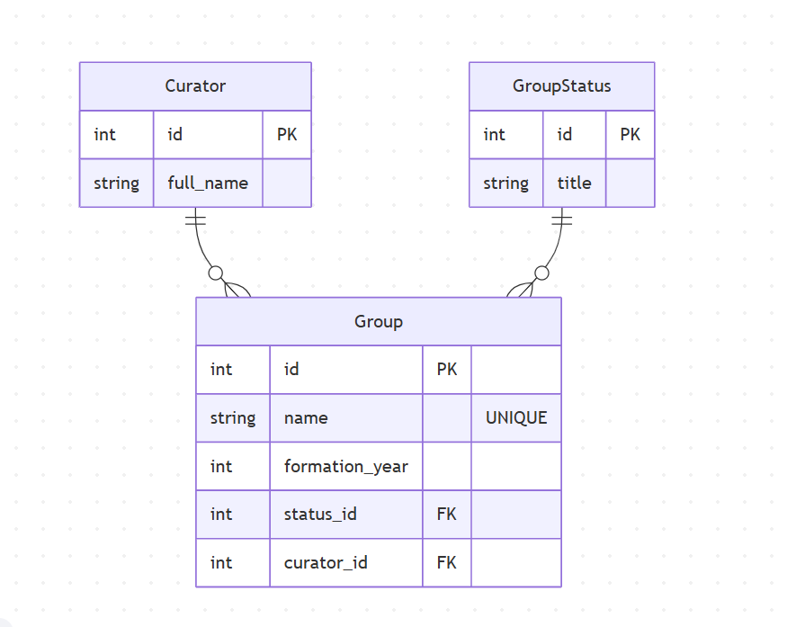

# Вариант №7. Сервис групп (Group Service)
**Исполнитель:** Столяров Артем Сергеевич
**Группа:** 24-1П11

## Функционал сервиса
* Создание и учет учебных групп.
* Ведение справочников кураторов и статусов групп (3НФ).
* Возможность изменения данных группы по ID.
* Удаление групп из системы.
* Получение списка групп с фильтрацией по году формирования.

---

## Добавить группу
Информация требуемая для создания группы

| Параметр | Обязательность | Тип | Ограничение | Значение по умолчанию |
| :--- | :--- | :--- | :--- | :--- |
| name | Обязательно | Строка | Уникальное, не пустое | — |
| formation_year | Обязательно | Целое | Не менее 2000 | — |
| curator_id | Обязательно | Целое | Существует в БД | — |
| status_id | Обязательно | Целое | Существует в БД | 1 |

**Выходные данные**

| Параметр | Тип |
| :--- | :--- |
| message | Строка |

---

## Изменить группу по ID
Информация требуемая для изменения группы по ID

| Параметр | Обязательность | Тип | Ограничение | Значение по умолчанию |
| :--- | :--- | :--- | :--- | :--- |
| formation_year | Не обязательно | Целое | — | — |
| curator_id | Не обязательно | Целое | — | — |
| status_id | Не обязательно | Целое | — | — |

**Выходные данные**

| Параметр | Тип |
| :--- | :--- |
| id | Целое |
| updated | Логический |

---

## Удаление группы по ID
Метод вернет **True**, если группа была удалена, иначе вернет **False**.

---

## Получить группу по ID
Информация возвращаемая в случае удачного поиска группы по ID

| Параметр | Тип |
| :--- | :--- |
| id | Целое |
| name | Строка |
| formation_year | Целое |
| status_title | Строка |
| curator_name | Строка |

---

## ER-диаграмма

